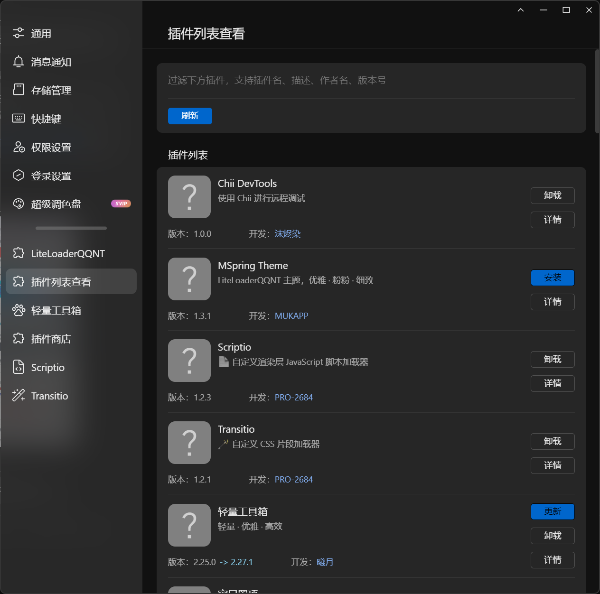

# LiteLoaderQQNT Plugin 插件列表查看

> [!NOTE]
> 该插件仅在 Windows 环境下测试开发，未对其他平台进行测试，不保证可用性

## 功能

- 插件列表查看
- 插件检查更新
- 插件安装（支持镜像）
- 插件卸载
- 插件查找



## 使用方法

### 下载发行版

1. 下载发行版并解压
2. 将文件夹移动至 `LiteLoaderQQNT数据目录/plugins/` 下面
3. 重启 QQNT

### 使用 git clone

1. clone 本仓库 `git clone https://github.com/ltxhhz/LL-plugin-list-viewer.git`
2. 运行以下命令
```bash
npm i
npm run build
```
3. 如果clone到了 `plugins` 目录下，修改 `manifest.json` 中`inject` 为
```json
"injects": {
    "main": "./dist/main/index.js",
    "preload": "./dist/preload/index.js",
    "renderer": "./dist/renderer/index.js"
}
```
>否则可以将 `dist` 目录移动到 `LiteLoaderQQNT数据目录/plugins/` 目录下

## 鸣谢

- [ltxhhz](https://github.com/ltxhhz) 辛苦我了
- [LiteLoaderQQNT](https://github.com/LiteLoaderQQNT/LiteLoaderQQNT)
- [LiteLoaderQQNT-PluginTemplate-Vite](https://github.com/MisaLiu/LiteLoaderQQNT-PluginTemplate-Vite)
